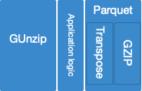

# Operational analysis

The following operational aspects are to be described:

* Running the application, dependencies
* Memory requirements
* CPU behavior
* Disk requirements


### Running the application
```java -jar <jar file> PARAMTERS...```

The jar is packaged standalone, so should depend only on openjdk.


### Memory requirements
The software tries to use streaming as much as possible. As such memory requirements are small, to the point of not really needing to configure memory during execution.

The GZIP part is the only place where streaming is not used, and there is logic to spill to disk in case of out of memory errors. This can happen when the Pico pcap files end up very large, an infrequent, but existing situation.

AWS configures their compute instances with the  1 CPU- 2GB RAM ration, so the application is designed with this heap size in mind. This means as many instances can be run in parallel as there are CPUs in the machine.

The application will output a warning message when disk spilling happens. If execution time seems out of control, heap size can be increased in 500MB increments.

### CPU requirements

 The application is *single threaded*. It’s main CPU-related steps are:

* Decompressing GZIP files
* Main packet processing loop
* Writing Parquet files.
At the time of writing, points #1 and #3 occupy more than 70% of CPU time, and cannot be easily parallelised. 
In fact, step #3 is also dominated by GZIP *compression* time, so one can say that the application spends most of its time in compression/decompression.
A sketch of the division of labour is:



### Disk requirements

The application does not require large amounts of I/O, as it is currently CPU bound.

In terms of disk space, given a set of input sources, it is advised to have at least 90% of their total file size available for the output parquet dataset. It is true that things like PCAP network envelopes are removed, that extra data was already very well compressed in the first place (due to being tightly packed together), and is replaced by some Parquet metadata.

There should be a 10GB buffer of space for when the decompression spills from RAM to disk. Note: Largest encountered decompressed size was 3GB, so this is a highly conservative value.